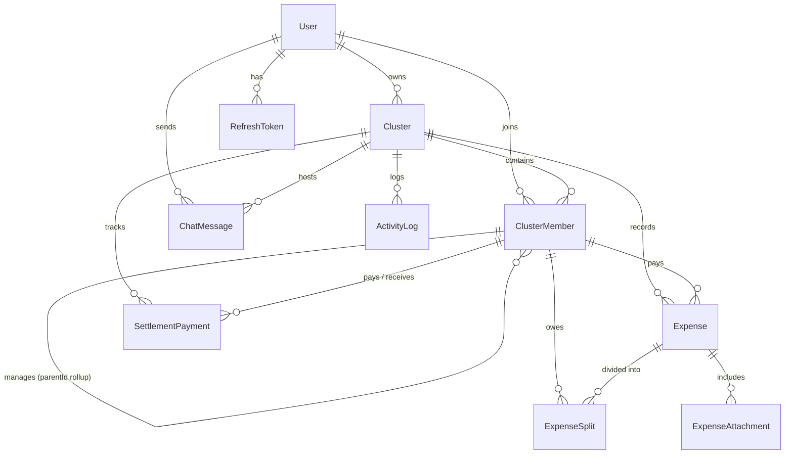

# Clustro.app — Production Full-Stack Architecture & Implementation Plan

Clustro.app is a production-grade, full-stack TypeScript web and hybrid mobile application for group financial management, shared ledgers, family/trip/society expense splitting, hierarchical dependent rollups, debt settlements, receipt management, real-time communication, and activity audit trails.

This document presents the complete system architecture, data models, API specifications, settlement mathematics, security boundaries, and phased roadmap to replace the reference prototype (`kunba-prototype.jsx`) with an enterprise-ready, PostgreSQL-backed implementation.

---

## User Review Required

> [!IMPORTANT]
> **Stack Confirmation & Design Highlights**
> - **Backend & Runtime**: Node.js + Express / Fastify or Next.js Full-Stack with TypeScript.
> - **ORM & Database**: Prisma ORM with PostgreSQL (leveraging transactions, `NUMERIC(14,2)` monetary precision, foreign keys, and indexes).
> - **Authentication**: Secure JWT with HTTP-only cookies, Argon2/Bcrypt password hashing, refresh token rotation, and RBAC at system and cluster level.
> - **Real-Time Engine**: Socket.io / WebSocket server for live chat and cluster event streaming.
> - **Storage Layer**: Modular storage provider (Local disk with static asset streaming for dev + AWS S3 / Cloudflare R2 presigned URLs for production).
> - **Hybrid Mobile**: Vite + React + Capacitor / PWA architecture ensuring responsive 100% parity across web, iOS, and Android.

---

## High-Level Architecture Overview

```
 ┌──────────────────────────────────────────────────────────────────────────┐
 │                          CLIENT LAYER (TypeScript)                       │
 │  ┌─────────────────────────────────┐   ┌──────────────────────────────┐  │
 │  │      Web App (React 19/18)      │   │  Hybrid Mobile (Capacitor)   │  │
 │  │  • Responsive Ledger UI         │   │  • Native Camera / Receipts  │  │
 │  │  • Offline Cache & Optimistic   │   │  • Push Notifications        │  │
 │  │  • Real-time Socket Listener    │   │  • Native Safe Areas & Gest. │  │
 │  └─────────────────────────────────┘   └──────────────────────────────┘  │
 └─────────────────────────────────────┬────────────────────────────────────┘
                                       │ HTTPS / WSS
 ┌─────────────────────────────────────▼────────────────────────────────────┐
 │                         BACKEND API & SERVICES                           │
 │  ┌──────────────────────────────┐     ┌───────────────────────────────┐  │
 │  │      REST / API Router       │     │     WebSocket / Gateway       │  │
 │  │  • Auth & User Management    │     │  • Cluster Chat Room Sync     │  │
 │  │  • Clusters & Members        │     │  • Real-time Balance Triggers │  │
 │  │  • Expenses & Splits         │     │  • Live Presence              │  │
 │  │  • Settlement Engine         │     └───────────────────────────────┘  │
 │  │  • Audit Trail & CSV Export  │                                        │
 │  └──────────────┬───────────────┘                                        │
 │                 │                                                        │
 │  ┌──────────────▼───────────────┐     ┌───────────────────────────────┐  │
 │  │      Business Logic Core     │     │      Storage Service          │  │
 │  │  • Hierarchical Rollup Math  │     │  • Image Resizer / Optimizer  │  │
 │  │  • Min-Cash-Flow Simplifier  │     │  • S3 / R2 / Local Provider   │  │
 │  │  • Atomic Ledger Transaction │     │  • Presigned URL Generator    │  │
 │  └──────────────┬───────────────┘     └───────────────┬───────────────┘  │
 └─────────────────┼─────────────────────────────────────┼──────────────────┘
                   │                                     │
 ┌─────────────────▼─────────────────────────────────────▼──────────────────┐
 │                           PERSISTENCE LAYER                              │
 │  ┌──────────────────────────────────────┐  ┌──────────────────────────┐  │
 │  │          PostgreSQL 16               │  │  Object Storage (S3/R2)  │  │
 │  │  • Users, Sessions, Clusters         │  │  • Receipt Photos        │  │
 │  │  • Members (Roles & Hierarchies)     │  │  • Avatars & Exports     │  │
 │  │  • Expenses, ExpenseSplits           │  └──────────────────────────┘  │
 │  │  • Settlements & Payments            │                                │
 │  │  • Chat Messages & Activity Logs     │                                │
 │  └──────────────────────────────────────┘                                │
 └──────────────────────────────────────────────────────────────────────────┘
```

---

## Database Entity-Relationship Design (PostgreSQL)

All monetary fields use `NUMERIC(14,2)` or integer cents to prevent IEEE-754 binary floating-point roundoff errors.



### Relational Schema Specification

#### 1. `users`
- `id`: `UUID PRIMARY KEY DEFAULT gen_random_uuid()`
- `email`: `VARCHAR(255) UNIQUE NOT NULL`
- `phone`: `VARCHAR(32) UNIQUE`
- `name`: `VARCHAR(100) NOT NULL`
- `username`: `VARCHAR(50) UNIQUE NOT NULL`
- `password_hash`: `VARCHAR(255) NOT NULL`
- `avatar_url`: `TEXT`
- `is_active`: `BOOLEAN DEFAULT true`
- `created_at`: `TIMESTAMPTZ DEFAULT NOW()`
- `updated_at`: `TIMESTAMPTZ DEFAULT NOW()`

#### 2. `refresh_tokens`
- `id`: `UUID PRIMARY KEY DEFAULT gen_random_uuid()`
- `user_id`: `UUID NOT NULL REFERENCES users(id) ON DELETE CASCADE`
- `token_hash`: `VARCHAR(255) NOT NULL`
- `expires_at`: `TIMESTAMPTZ NOT NULL`
- `revoked_at`: `TIMESTAMPTZ`
- `created_at`: `TIMESTAMPTZ DEFAULT NOW()`

#### 3. `clusters`
- `id`: `UUID PRIMARY KEY DEFAULT gen_random_uuid()`
- `name`: `VARCHAR(120) NOT NULL`
- `type`: `VARCHAR(32) NOT NULL` (e.g., `'family'`, `'trip'`, `'friends'`, `'society'`, `'other'`)
- `status`: `VARCHAR(20) NOT NULL DEFAULT 'live'` (`'live'`, `'pending'`, `'ended'`)
- `currency`: `VARCHAR(3) NOT NULL DEFAULT 'INR'`
- `start_date`: `DATE`
- `end_date`: `DATE`
- `owner_id`: `UUID NOT NULL REFERENCES users(id) ON DELETE RESTRICT`
- `created_at`: `TIMESTAMPTZ DEFAULT NOW()`
- `updated_at`: `TIMESTAMPTZ DEFAULT NOW()`
- `deleted_at`: `TIMESTAMPTZ` (Soft delete)

#### 4. `cluster_members`
- `id`: `UUID PRIMARY KEY DEFAULT gen_random_uuid()`
- `cluster_id`: `UUID NOT NULL REFERENCES clusters(id) ON DELETE CASCADE`
- `user_id`: `UUID REFERENCES users(id) ON DELETE SET NULL` (Nullable for offline/placeholder members)
- `display_name`: `VARCHAR(100) NOT NULL`
- `role`: `VARCHAR(20) NOT NULL DEFAULT 'member'` (`'owner'`, `'head'`, `'member'`, `'inherited'`)
- `parent_member_id`: `UUID REFERENCES cluster_members(id) ON DELETE SET NULL` (Rolls up to this head for `'inherited'`)
- `is_placeholder`: `BOOLEAN DEFAULT false` (True if member has no linked registered user)
- `created_at`: `TIMESTAMPTZ DEFAULT NOW()`
- `updated_at`: `TIMESTAMPTZ DEFAULT NOW()`
- **Constraints**: 
  - `UNIQUE(cluster_id, user_id)` (where user_id is not null)
  - `CHECK (role != 'inherited' OR parent_member_id IS NOT NULL)`

#### 5. `expenses`
- `id`: `UUID PRIMARY KEY DEFAULT gen_random_uuid()`
- `cluster_id`: `UUID NOT NULL REFERENCES clusters(id) ON DELETE CASCADE`
- `paid_by_member_id`: `UUID NOT NULL REFERENCES cluster_members(id) ON DELETE RESTRICT`
- `amount`: `NUMERIC(14, 2) NOT NULL CHECK (amount > 0)`
- `currency`: `VARCHAR(3) NOT NULL DEFAULT 'INR'`
- `description`: `VARCHAR(255) NOT NULL`
- `category`: `VARCHAR(64)` (e.g., `'Food'`, `'Transport'`, `'Accommodation'`, `'Groceries'`, `'Utilities'`)
- `expense_date`: `DATE NOT NULL DEFAULT CURRENT_DATE`
- `split_type`: `VARCHAR(20) NOT NULL DEFAULT 'EQUAL'` (`'EQUAL'`, `'EXACT'`, `'PERCENTAGE'`, `'SHARES'`)
- `created_by_user_id`: `UUID NOT NULL REFERENCES users(id)`
- `created_at`: `TIMESTAMPTZ DEFAULT NOW()`
- `updated_at`: `TIMESTAMPTZ DEFAULT NOW()`
- `deleted_at`: `TIMESTAMPTZ`

#### 6. `expense_splits`
- `id`: `UUID PRIMARY KEY DEFAULT gen_random_uuid()`
- `expense_id`: `UUID NOT NULL REFERENCES expenses(id) ON DELETE CASCADE`
- `member_id`: `UUID NOT NULL REFERENCES cluster_members(id) ON DELETE RESTRICT`
- `allocated_amount`: `NUMERIC(14, 2) NOT NULL CHECK (allocated_amount >= 0)`
- `percentage_or_weight`: `NUMERIC(6, 3)`
- `created_at`: `TIMESTAMPTZ DEFAULT NOW()`
- **Constraint**: `UNIQUE(expense_id, member_id)`

#### 7. `expense_attachments`
- `id`: `UUID PRIMARY KEY DEFAULT gen_random_uuid()`
- `expense_id`: `UUID NOT NULL REFERENCES expenses(id) ON DELETE CASCADE`
- `storage_key`: `TEXT NOT NULL`
- `file_url`: `TEXT NOT NULL`
- `file_type`: `VARCHAR(64)`
- `file_size_bytes`: `INTEGER`
- `created_at`: `TIMESTAMPTZ DEFAULT NOW()`

#### 8. `settlement_payments` (Recording completed payouts)
- `id`: `UUID PRIMARY KEY DEFAULT gen_random_uuid()`
- `cluster_id`: `UUID NOT NULL REFERENCES clusters(id) ON DELETE CASCADE`
- `from_member_id`: `UUID NOT NULL REFERENCES cluster_members(id) ON DELETE RESTRICT`
- `to_member_id`: `UUID NOT NULL REFERENCES cluster_members(id) ON DELETE RESTRICT`
- `amount`: `NUMERIC(14, 2) NOT NULL CHECK (amount > 0)`
- `payment_method`: `VARCHAR(50)` (e.g., `'UPI'`, `'Cash'`, `'Bank Transfer'`, `'Other'`)
- `reference_note`: `TEXT`
- `recorded_by_user_id`: `UUID NOT NULL REFERENCES users(id)`
- `created_at`: `TIMESTAMPTZ DEFAULT NOW()`

#### 9. `chat_messages`
- `id`: `UUID PRIMARY KEY DEFAULT gen_random_uuid()`
- `cluster_id`: `UUID NOT NULL REFERENCES clusters(id) ON DELETE CASCADE`
- `sender_id`: `UUID NOT NULL REFERENCES users(id) ON DELETE CASCADE`
- `message_text`: `TEXT NOT NULL`
- `attachments`: `JSONB DEFAULT '[]'`
- `created_at`: `TIMESTAMPTZ DEFAULT NOW()`

#### 10. `activity_logs` (Audit History)
- `id`: `UUID PRIMARY KEY DEFAULT gen_random_uuid()`
- `cluster_id`: `UUID NOT NULL REFERENCES clusters(id) ON DELETE CASCADE`
- `actor_id`: `UUID REFERENCES users(id) ON DELETE SET NULL`
- `action_type`: `VARCHAR(64) NOT NULL` (e.g., `'CLUSTER_CREATED'`, `'MEMBER_ADDED'`, `'EXPENSE_CREATED'`, `'STATUS_CHANGED'`, `'SETTLEMENT_RECORDED'`)
- `summary_text`: `TEXT NOT NULL`
- `metadata`: `JSONB DEFAULT '{}'`
- `created_at`: `TIMESTAMPTZ DEFAULT NOW()`

---

## Financial Calculation & Settlement Architecture

### 1. Hierarchical Dependent Rollup Engine
In traditional split apps, every person is an isolated balance. In Clustro (inspired by Indian family structures and group hierarchies), a parent/head can pay or be liable on behalf of dependent children or sub-family units:
1. Every member with `role === 'inherited'` has a required `parent_member_id`.
2. **Effective Member Resolution**:
   $$\text{effectiveId}(m) = \begin{cases} m.\text{parent\_member\_id} & \text{if } m.\text{role} = \text{'inherited'} \land m.\text{parent\_member\_id} \neq \text{null} \\ m.\text{id} & \text{otherwise} \end{cases}$$
3. **Aggregated Paid and Owed Sums**:
   $$\text{Paid}(\text{effId}) = \sum_{e \in \text{Expenses}, \text{effId}(e.\text{payer}) = \text{effId}} e.\text{amount}$$
   $$\text{Owed}(\text{effId}) = \sum_{e \in \text{Expenses}} \sum_{s \in e.\text{splits}, \text{effId}(s.\text{member}) = \text{effId}} s.\text{allocated\_amount}$$
4. **Settled Payments Offset**:
   Direct recorded payments between effective members adjust net balances before running settlement graphs.
5. **Net Balance**:
   $$\text{Net}(\text{effId}) = \text{Paid}(\text{effId}) - \text{Owed}(\text{effId}) + \text{SettledReceived}(\text{effId}) - \text{SettledPaid}(\text{effId})$$

### 2. Min-Cash-Flow Settlement Simplification Algorithm
The system computes an optimal minimal transaction set to resolve all balances:
1. Categorize all effective members into two priority heaps:
   - **Debtors** ($\text{Net} < -0.01$, sorted descending by amount owed)
   - **Creditors** ($\text{Net} > +0.01$, sorted descending by amount to receive)
2. In each iteration, take $\text{debtor}_i$ and $\text{creditor}_j$:
   $$\text{transferAmount} = \min(|\text{Net}_i|, |\text{Net}_j|)$$
   Create settlement suggestion: $\text{debtor}_i \to \text{creditor}_j$ with $\text{transferAmount}$.
3. Deduct $\text{transferAmount}$ from both. Re-sort or shift pointers until all balances are within $\pm 0.01$ (settled).
4. Time Complexity: $O(N \log N)$ where $N$ is the number of effective heads/members.

---

## Authentication & Authorization Model (RBAC)

### 1. Authentication Flow
- **Access Tokens**: Short-lived JWTs (15 min) in memory or Authorization headers.
- **Refresh Tokens**: Long-lived (30 days) stored securely in `HttpOnly`, `SameSite=Strict`, `Secure` cookies, hashed in the database, with automatic rotation and reuse detection.
- **Password Security**: Argon2id or Bcrypt (work factor 12) with salt.

### 2. Cluster Authorization Matrix

| Action | Cluster Owner | Family Head | Standard Member | Inherited / Dependent |
|---|:---:|:---:|:---:|:---:|
| **Edit Cluster Details / Dates** | ✅ Yes | ❌ No | ❌ No | ❌ No |
| **Change Cluster Status (Live/Pending/Ended)** | ✅ Yes | ❌ No | ❌ No | ❌ No |
| **Add / Remove Members** | ✅ Yes | ✅ (Own sub-family) | ❌ No | ❌ No |
| **Add Expense** | ✅ Yes | ✅ Yes | ✅ Yes | ❌ View only |
| **Edit / Delete Own Expense** | ✅ Yes | ✅ Yes | ✅ Yes | ❌ No |
| **Edit / Delete Any Expense** | ✅ Yes | ❌ No | ❌ No | ❌ No |
| **View Balances & Settle Up** | ✅ Yes | ✅ Yes | ✅ Yes | ✅ View only |
| **Record Settlement Payment** | ✅ Yes | ✅ Yes | ✅ Yes | ❌ No |
| **Send Chat Message** | ✅ Yes | ✅ Yes | ✅ Yes | ✅ Yes (if registered) |
| **Export CSV** | ✅ Yes | ✅ Yes | ✅ Yes | ✅ Yes |

---

## File Storage & Media Processing Architecture

1. **Upload Pipeline**:
   - Client sends multipart file request or requests a presigned PUT URL from API.
   - API verifies cluster membership, validates MIME type (`image/jpeg`, `image/png`, `image/webp`, `application/pdf`), and enforces max size (10 MB).
   - Server-side / Worker optimization with `sharp` to generate:
     - `thumbnail` (200x200 webp) for fast feed listing
     - `compressed` (max 1200px width, 80% quality webp) for detail view
   - Stored in object storage (AWS S3, Cloudflare R2, or local disk storage provider with standard interface).
2. **Abstract Storage Provider Interface**:
   - `uploadFile(fileBuffer, key, mimeType)`
   - `getSignedDownloadUrl(key, expiresInSeconds)`
   - `deleteFile(key)`

---

## Real-Time & Chat Architecture

- **Engine**: WebSocket / Socket.io with JWT handshake authentication.
- **Rooms**: Scoped to `cluster:{clusterId}`.
- **Events**:
  - `join_cluster` / `leave_cluster`
  - `new_message` (broadcasts message to room and stores to DB)
  - `expense_added` / `expense_updated` (triggers live balance recompute in all active clients)
  - `settlement_recorded` (updates live payment statuses)
  - `member_typing` / `presence_update`

---

## Clean Folder Structure

```
clustro-app/
├── package.json
├── tsconfig.json
├── docker-compose.yml
│
├── apps/
│   ├── api/                           # Backend API Server
│   │   ├── prisma/
│   │   │   ├── schema.prisma          # PostgreSQL DB Schema & Migrations
│   │   │   └── seed.ts                # Test & demo seed data
│   │   ├── src/
│   │   │   ├── config/                # Environment, constants, DB client
│   │   │   ├── modules/
│   │   │   │   ├── auth/              # Auth routes, JWT, refresh tokens
│   │   │   │   ├── users/             # User profile, search
│   │   │   │   ├── clusters/          # Clusters CRUD, status, dates
│   │   │   │   ├── members/           # Cluster members & hierarchy
│   │   │   │   ├── expenses/          # Expenses, splits, attachments
│   │   │   │   ├── settlements/       # Settlement calculation & payouts
│   │   │   │   ├── chat/              # Chat history & socket gateway
│   │   │   │   └── activity/          # Activity log / audit trail
│   │   │   ├── services/
│   │   │   │   ├── settlementEngine.ts# Math & graph minimization
│   │   │   │   ├── storageService.ts  # S3 / R2 / local storage
│   │   │   │   └── csvExport.ts       # CSV generation
│   │   │   ├── middlewares/           # Auth, RBAC, error handler, validation
│   │   │   ├── sockets/               # Real-time WebSocket handlers
│   │   │   └── index.ts               # Server entry point
│   │   └── tests/                     # Unit & integration tests (Vitest/Jest)
│   │
│   └── web/                           # Frontend React / Hybrid Mobile
│       ├── capacitor.config.ts        # Hybrid iOS/Android configuration
│       ├── index.html
│       ├── src/
│       │   ├── assets/
│       │   ├── components/            # UI Component Library (Modals, Buttons, etc.)
│       │   │   ├── common/
│       │   │   ├── cluster/
│       │   │   ├── expense/
│       │   │   ├── settlement/
│       │   │   └── chat/
│       │   ├── contexts/              # Auth, Socket, ActiveCluster contexts
│       │   ├── hooks/                 # useBalances, useCluster, useDebounce
│       │   ├── pages/                 # Home, ClusterDetail, Auth, Ledger
│       │   ├── services/              # API Client (Axios/Fetch), SocketClient
│       │   ├── types/                 # Shared TypeScript interfaces
│       │   ├── utils/                 # Money formatters, date helpers
│       │   ├── App.tsx
│       │   ├── main.tsx
│       │   └── index.css              # Rich design system, typography & theme
│       └── tests/
│
└── packages/
    └── shared/                        # Shared DTOs, validation schemas (Zod)
        ├── src/
        │   ├── types.ts
        │   └── schemas.ts
        └── package.json
```

---

## API Module Specifications (REST & WebSocket)

### Authentication (`/api/v1/auth`)
- `POST /register`: Register user (name, username, email, phone, password).
- `POST /login`: Authenticate and receive JWT + HttpOnly refresh cookie.
- `POST /refresh`: Rotate refresh token and issue new access token.
- `POST /logout`: Revoke active session.
- `GET /me`: Fetch authenticated user profile.

### Clusters (`/api/v1/clusters`)
- `GET /`: List all clusters where user is a member (filtered by `status=live|pending|ended`).
- `POST /`: Create cluster (name, type, status, startDate, endDate). Automatically assigns creator as `'owner'`.
- `GET /:id`: Fetch cluster details, members, and aggregated summary.
- `PATCH /:id`: Update cluster metadata, status, or date range (Owner only).
- `DELETE /:id`: Soft delete cluster (Owner only).
- `GET /:id/export-csv`: Stream formatted CSV of all expenses and member splits.

### Members (`/api/v1/clusters/:id/members`)
- `GET /`: List members of cluster with hierarchical parent/head details.
- `POST /`: Add member (supports registered user link or offline placeholder with role and `parentId`).
- `PATCH /:memberId`: Update member role or parent rollup.
- `DELETE /:memberId`: Remove member from cluster.

### Expenses (`/api/v1/clusters/:id/expenses`)
- `GET /`: List cluster expenses with pagination, filtering, and attached receipts.
- `POST /`: Create expense (multipart/form-data for receipt or JSON with split rules).
- `GET /:expenseId`: Get single expense with full split details.
- `PATCH /:expenseId`: Update expense or split allocation.
- `DELETE /:expenseId`: Delete expense and trigger audit log.

### Settlements (`/api/v1/clusters/:id/settlements`)
- `GET /balances`: Compute current balances for all effective members (paid, owed, net balance).
- `GET /suggestions`: Get minimized transaction graph ($\text{from} \to \text{to} \to \text{amount}$).
- `POST /payments`: Record a completed settlement payment between two members.
- `GET /payments`: List past settlement payments.

### Activity & History (`/api/v1/clusters/:id/activity`)
- `GET /`: Paginated activity trail for the cluster.

### Chat & WebSockets (`/api/v1/clusters/:id/chat`)
- `GET /messages`: Paginated chat history.
- WSS Events: `send_message`, `receive_message`, `typing`, `balance_updated`.

---

## Testing Strategy

1. **Unit Testing (Vitest)**:
   - Settlement calculation algorithm:
     - Equal splits among $N$ members.
     - Single payer, multiple debtors.
     - Hierarchical inherited members (2 heads, 3 dependents each).
     - Decimal precision edge cases (e.g., ₹100 split 3 ways $\to$ ₹33.34, ₹33.33, ₹33.33 without losing 1 paisa).
     - Net zero sanity checks ($\sum \text{Net balances} = 0$).
2. **Integration Testing (Supertest + PostgreSQL Testcontainers/Local DB)**:
   - Full authentication lifecycle (Register $\to$ Login $\to$ Refresh $\to$ Access Protected Route).
   - Cluster creation and RBAC enforcement (non-owner cannot edit dates/delete cluster).
   - Expense creation with transactions, verifying splits sum to expense total.
3. **End-to-End Verification (Browser Subagent / Playwright)**:
   - Visual inspection of responsive layouts (desktop & mobile viewport).
   - Real-time chat message delivery between two browser sessions.
   - Receipt upload and image preview verification.
   - CSV export generation.

---

## Phased Implementation Roadmap

### Phase 1: Environment & Full-Stack Foundation
- Setup monorepo workspace with TypeScript configuration.
- Initialize backend API with Express/Node.js, Prisma ORM, and PostgreSQL connection.
- Define Prisma schema for all 10 core tables with indexes, relations, and migrations.
- Build JWT authentication with password hashing, refresh tokens, and user profile management.

### Phase 2: Core Domain Logic & Settlement Engine
- Implement hierarchical member management (Owner, Head, Member, Inherited with parent rollups).
- Build the Expense & Split engine with atomic database transactions.
- Implement the precision Min-Cash-Flow settlement engine with full test suite.
- Add settlement payment recording and audit logging.

### Phase 3: Premium Frontend & Hybrid Mobile UI
- Build the frontend design system (Fraunces + Inter typography, warm stone/emerald ledger aesthetics, micro-animations, glassmorphic modals).
- Implement Home Dashboard (Live, Pending, Ended tabs, global aggregated spend card, "My Ledger" view).
- Implement Cluster View (Ledger hero card, member badges with role chips, expense stream with receipts, collapsible activity trail).
- Add modals: New Cluster (with date quick-picks), Add Member (with roll-up selector), Add Expense (with photo upload & split toggle), Settle Up (live debt flow).

### Phase 4: Media Storage, CSV Export & Real-Time Sync
- Implement local/cloud media storage service with image compression.
- Add CSV export engine streaming download.
- Integrate Socket.io WebSocket server and client for real-time cluster chat and instant balance sync.

### Phase 5: Verification, Testing & Polish
- Run automated unit and integration test suites.
- Perform end-to-end user flow verification in the browser.
- Validate mobile responsiveness, offline caching, and PWA/Capacitor configuration.

---

## Verification Plan

### Automated Tests
- `npm run test` across `packages/shared`, `apps/api`, and `apps/web`.
- Verification of 100% precision in financial settlement test suites.

### Manual & Interactive Verification
- User registration and login flow.
- Creation of clusters (Family, Trip, Friends) with varied date ranges.
- Adding hierarchical members (Heads with Inherited dependents).
- Multi-way expense entry with receipt photo attachment.
- Verifying Settle-up recommendations correctly aggregate dependents into their respective heads.
- Live chat message sending and receipt across clients.
- Downloading and inspecting the expense CSV export.
